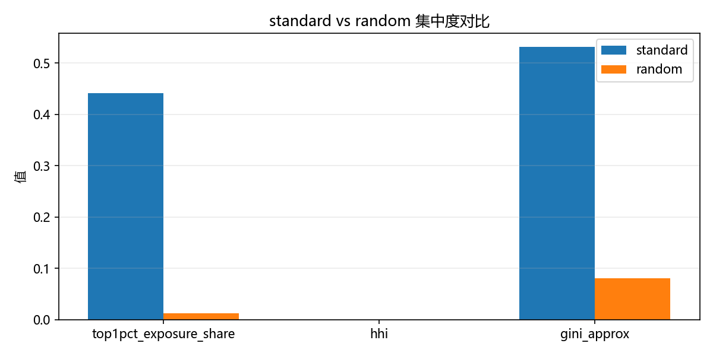
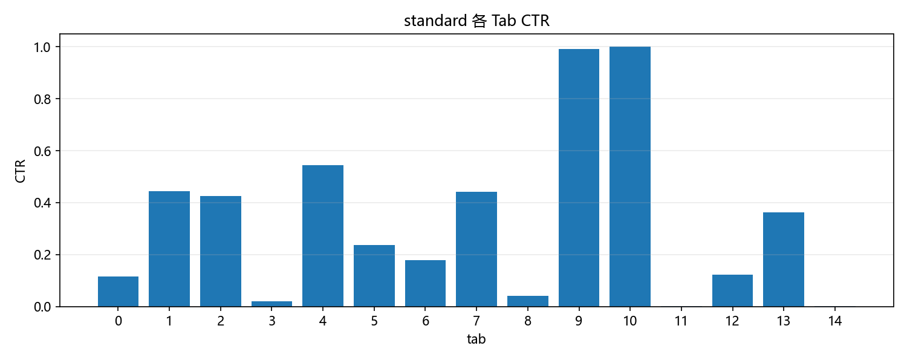
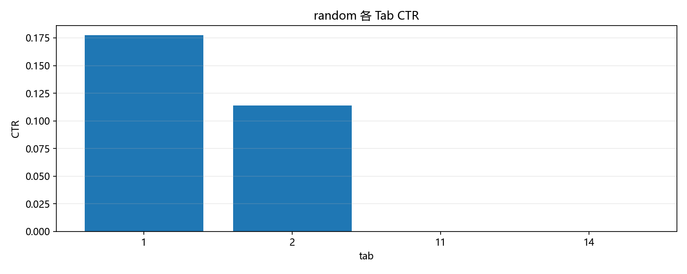
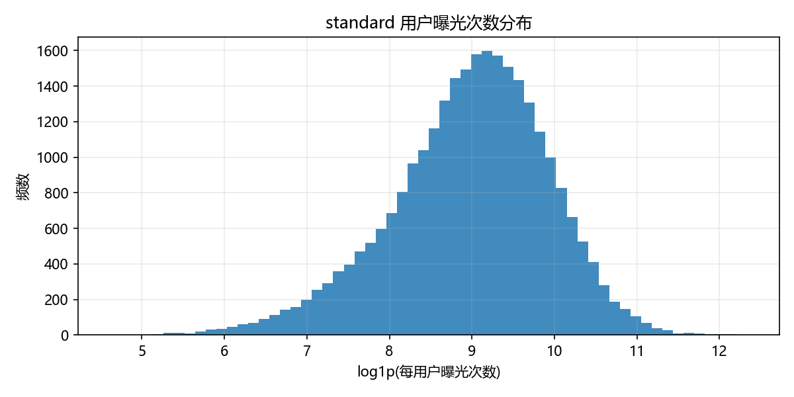
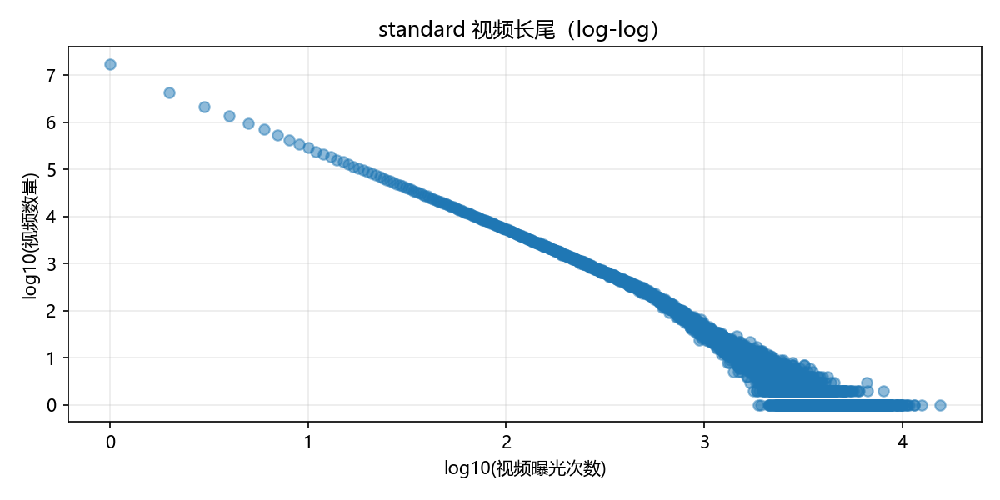
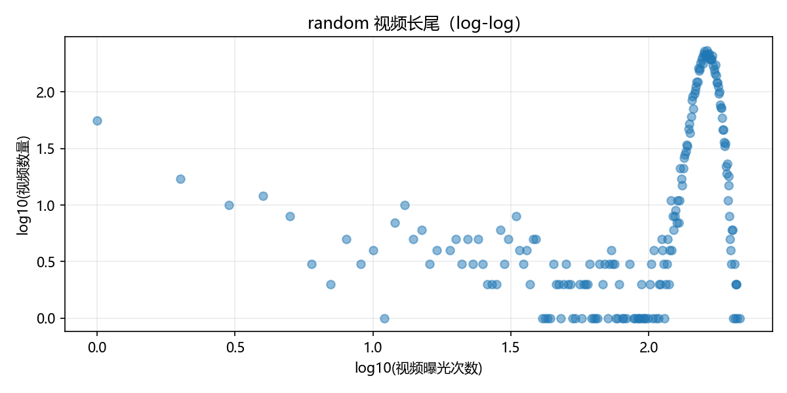
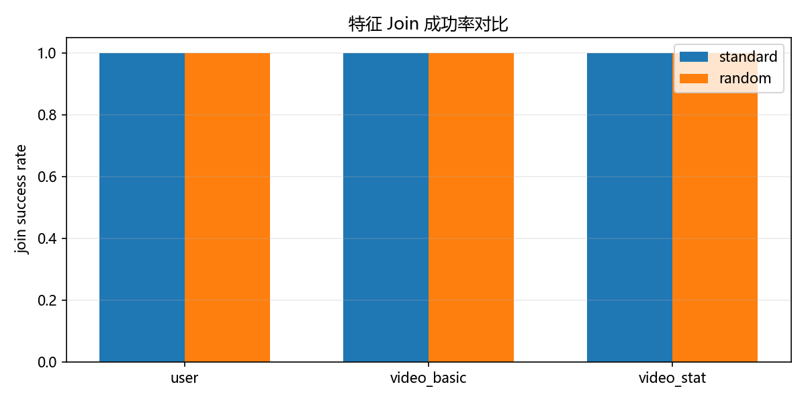
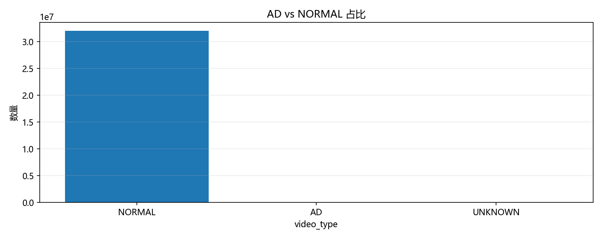
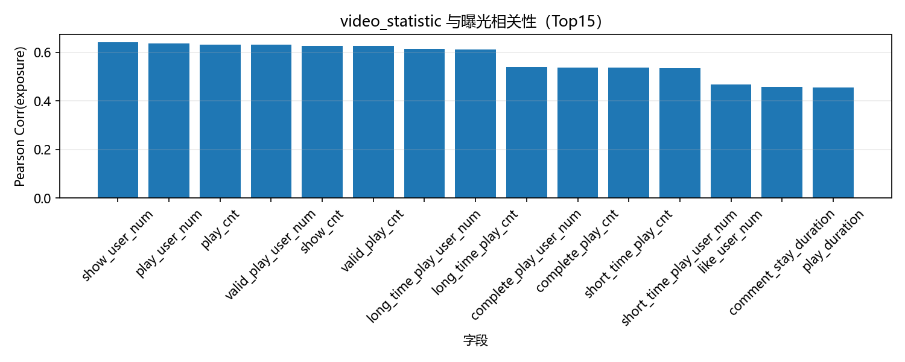

## 1) 问题定义与数据价值

**一句话问题**  
在强偏置曝光日志下，如何得到更可信的离线评测结论，并落地可复现 CTR baseline？

- KuaiRand 同时提供 `standard log` + `random log`
- `random` 来自随机干预曝光子集，更接近无偏评测锚点
- 适合做离线因果校准、策略对比、分桶评估
- 目标：把 EDA 结果转成可执行实验计划（而不止描述统计）

::: notes
面试口播：核心不是“把图画漂亮”，而是“把偏置机制讲清楚”。我先用 random 作为锚点，再解释它的边界，最后落到实验设计。
:::

## 2) 数据概览（版本/时间窗/规模）

- 数据目录：`./kuairand_report/`（由 `run_eda.py` 全量生成）
- 时间窗：`2022-04-08 ~ 2022-05-08`
- Standard：322,278,385 曝光 / 27,285 用户 / 32,038,693 视频
- Random：1,186,059 曝光 / 27,285 用户 / 7,583 视频
- 总体 CTR：Standard=0.3787，Random=0.1762

> 解释：两类日志 CTR 不可直接横向当“策略优劣”，必须结合曝光机制解释。

## 3) 核心发现 1：曝光分布机制差异（偏置 vs 随机）

{fig-alt="standard vs random 曝光集中度对比" width="86%"}

- Top1% 曝光占比：Standard=44.11%，Random=1.27%
- Gini：Standard=0.531，Random=0.081
- 结论：standard 强头部集中，random 更均匀，适合作为评测锚点

::: notes
面试口播：这是最关键一页。先给集中度证据，再引出“为什么 random 更能衡量模型泛化，而不是复读线上分发偏置”。
:::

## 4) 核心发现 2：CTR 差异与场景分桶

::: columns
::: {.column width="50%"}
{fig-alt="standard 按 tab CTR"}
:::
::: {.column width="50%"}
{fig-alt="random 按 tab CTR"}
:::
:::

- Standard vs Random CTR 差值约 `+0.2026`
- bootstrap 95% CI: `[0.2019, 0.2032]`（来自现有统计表）
- 结论：CTR 解释需带上“曝光策略条件”，不能把两者当同分布样本

::: notes
面试口播：我不会只报一个总体 CTR，而是必须按 tab 分桶看，避免被某个场景占比误导。
:::

## 5) 核心发现 3：用户/视频长尾与头部集中

::: columns
::: {.column width="33%"}
{fig-alt="用户曝光分布"}
:::
::: {.column width="33%"}
{fig-alt="standard 视频长尾"}
:::
::: {.column width="33%"}
{fig-alt="random 视频长尾"}
:::
:::

- 用户行为与视频消费均呈长尾
- standard 的长尾更“头重脚轻”，强化热门项反馈循环
- random 对长尾项更友好，但样本稀疏、方差更高

::: notes
面试口播：这页用于回答“为什么线上容易越推越头部”。也顺带解释 random 虽然更公平，但噪声更大。
:::

## 6) 特征可用性与 Join 覆盖

{fig-alt="join 成功率对比" width="75%"}

- 当前数据中 user/video basic/video statistic 的 join 成功率接近 100%
- 可直接构建 `log + user_features + video_basic` baseline
- `video_features_statistic` 可用但需先做泄漏审计
- 推荐先做“无 statistic”与“含 statistic”双线对照

## 7) 实验与评测设计（我会怎么做）

- **时间切分**：早期 standard 构建历史，后期 standard 做 train/valid/test
- **评测锚点**：random 作为更可信离线对照集之一
- **指标**：AUC / LogLoss + 按 tab / 活跃度分桶报表
- **OPE 扩展**：可补充 IPS/DR 做策略离线稳健比较
- **显著性**：保留 bootstrap CI 与 z-test 作为统计保证

::: notes
面试口播：这里强调“可信度工程”：切分、防穿越、分桶和显著性是一套，不是单点技巧。
:::

## 8) 风险点与规避策略

- `is_click` 语义可能因 UI（双列/单列）发生变化  
  对策：分场景建模或重定义标签（如 valid_play）
- random 样本更稀疏，估计方差大  
  对策：分桶置信区间 + 多次重采样
- `video_features_statistic` 可能时间泄漏  
  对策：仅用训练窗重算，或首版禁用再做 ablation
- 候选池支持集限制  
  对策：报告中显式声明离线评测边界

## 9) 下一步（1 周可落地）

- D1-D2：训练 `LR/GBDT baseline`（无 statistic 特征）
- D3-D4：加入序列特征（最近 N 次曝光/点击统计）
- D5：加入 statistic 特征并做严格泄漏对照
- D6：在 random 上做离线评测 + IPS/DR 对比
- D7：输出可复用实验模板（数据切分、指标分桶、显著性）

> pointwise CTR 不需要显式负采样（`is_click=0` 即负例）；  
> ranking/pairwise 才需要 negatives：`曝光未点 hard neg` / `uniform neg`，并报告偏差。

## 10) 附录（可跳过）：数据与复现

**图表候选与入选清单**
- `assets/selected_figure_list.csv`

**关键表格**
- `../kuairand_report/tables/random_vs_standard_comparison.csv`
- `../kuairand_report/tables/log_standard_join_success.csv`
- `../kuairand_report/tables/log_random_join_success.csv`
- `../kuairand_report/tables/recommended_ctr_schema.csv`

**复现命令（项目根目录）**
```bash
python run_eda.py --data_dir "KuaiRand-27K/KuaiRand-27K/data" --out_dir "./kuairand_report" --engine duckdb --chunksize 200000 --seed 42
bash ./kuairand_interview/build.sh
```

## 附录 A：视频类型与潜在泄漏线索

::: columns
::: {.column width="50%"}
{fig-alt="视频类型分布"}
:::
::: {.column width="50%"}
{fig-alt="video_statistic 与曝光相关性"}
:::
:::

- AD/NORMAL 占比提醒我们做分层评估
- statistic 与曝光高相关不等于可直接用于训练，先排查时间穿越
